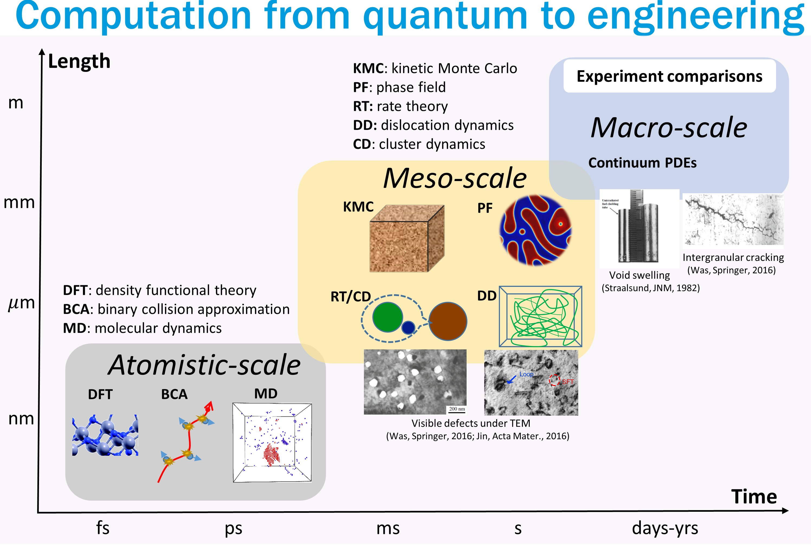

---
# Feel free to add content and custom Front Matter to this file.
# To modify the layout, see https://jekyllrb.com/docs/themes/#overriding-theme-defaults
layout: home
---
 

Materials performance has been critical for nuclear energy to make further improvements on safety and economics. The current and proposed future nuclear energy systems present an exceptionally harsh environment for structural materials due to the combination of high temperature, high stress, corrosive coolant, and intense radiation fluxes. In contrast to other energy industries, this additional radiation field brings out a number of degradation issues, and hence calls for meticulous assessment of material long-term behavior and development of advanced material resistant to degradation. 

Extensive computational characterization of radiation damage in materials is pursued  with multiple methods including physics-based models and data-driven techniques. These efforts have been aimed at <em>a robust descriptive and predicative paradigm for materials in nuclear applications</em>. 

 

**Research Highlights:** 

*Atomistic simulations of radiation resistance and defect interactions in advanced materials designs 

*Multiscale modeling to describe (micro)structural evolution

*Intergrating machine learning to accelerate materials discovery and investigation
 
  
  
 

  
